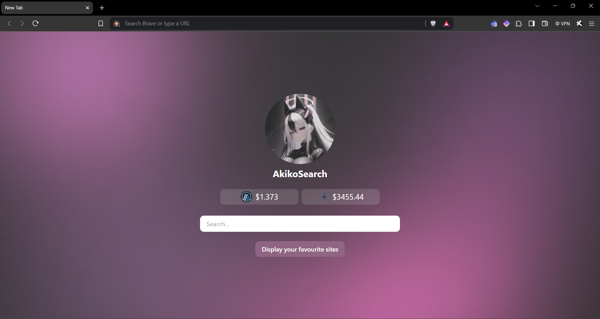
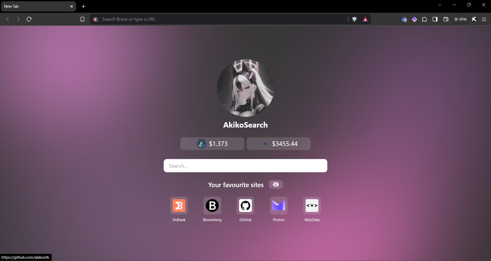

<div align="center">


# AkikoSearch

My own custom LlamaSearch where I have customized it for me, and I don't know why I'm writing this right now because I won't make this public...

But for if some day I make this public here it's, enjoy! This is simply a modified version of the LlamaSearch engine with custom icon, instead of showing my top pages it shows a custom array of my favorite websites, and the good thing of this is that I can make it as long or as short as I want. And in case one of the websites isn't showing its favicon it puts it from another custom site.

<div style="display: grid;
  grid-template-columns: 1fr 1fr;
  grid-gap: 5px;">
</div>
</div>

## Installation

To install this extension first you'll need to download the download the repo as a zip and then you'll need to go to [`chrome://extensions/`](chrome://extensions/), enable Developer Mode by clicking the toggle switch in the top right corner, and then unzip the extension in a Folder.

After that you can load unziped extension by going to [`chrome://extensions/`](chrome://extensions/) and `load unpacked`, make sure to have Developer Mode enabled .

Or you can clone the repo and load it manually by going to [`chrome://extensions/`](chrome://extensions/), and load unpacked`, again make sure to have Developer Mode enabled.

## Making your custom favorites list

To make your own favorites list is as easy as making a json file named [`favorites.json`](./assets/json/favorites.json) with the following structure:

```json
{
    "favorites" : [
        {
            {
                "url": "https://example.com",
                "title": "Example",
                "img": "in case you want to use a custom image it has to be an url"
            },
            {
                "url": "https://example.com",
                "title": "Example",
                "img": ""
            }
        }
    ]
}
```

Then is as easy as replacing the [`favorites.json`](./assets/json/favorites.json) file found in [`assets/json`](./assets/json) and that's it, you can make it as long as you want. But I would recommend making it at most 10 long.

---

AkikoEth
